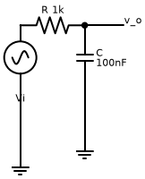
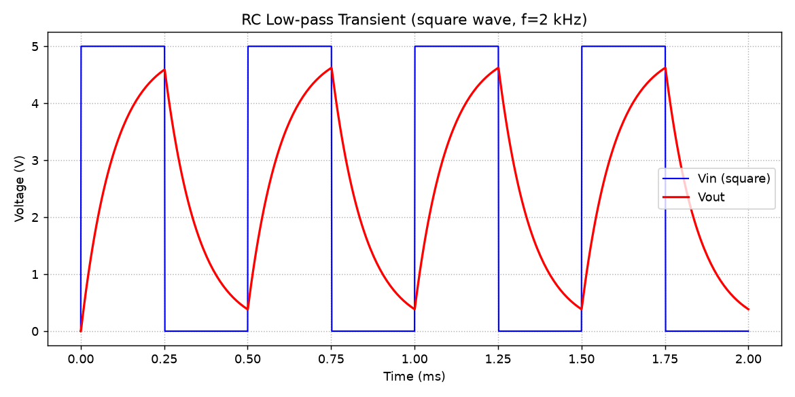
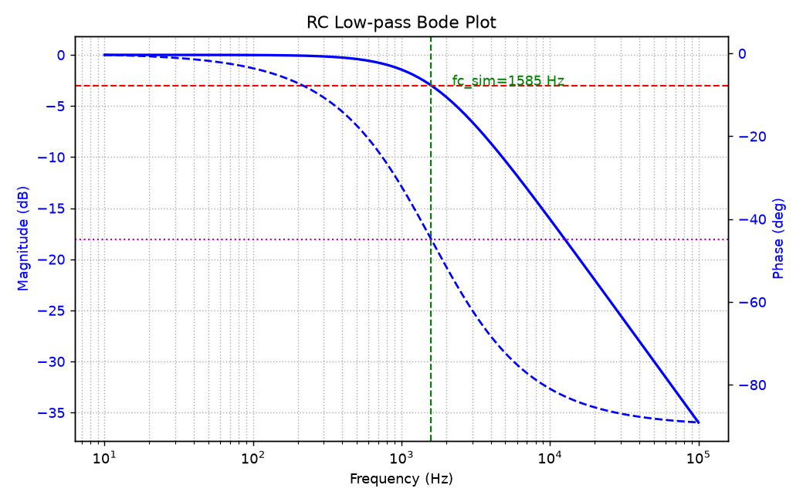
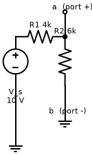
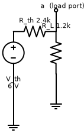
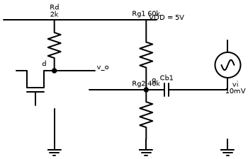
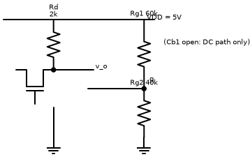
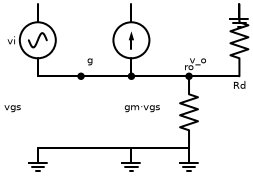
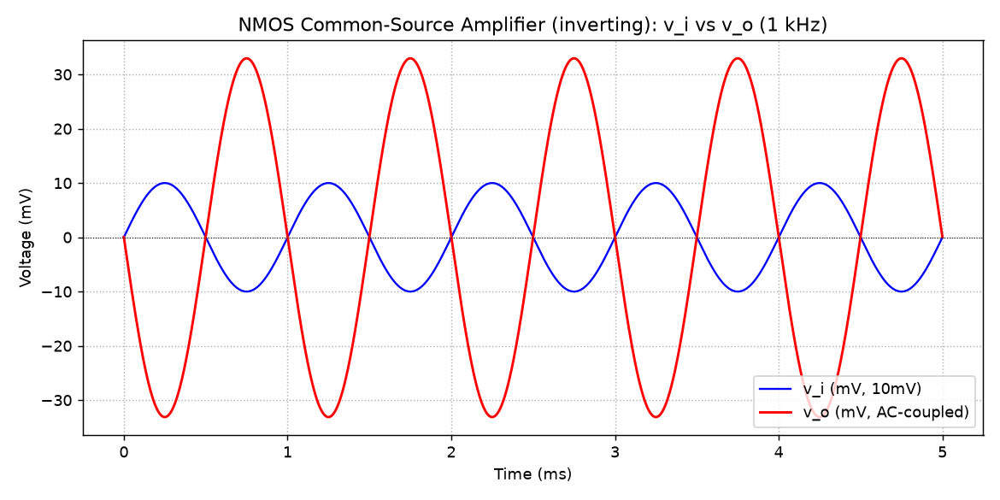
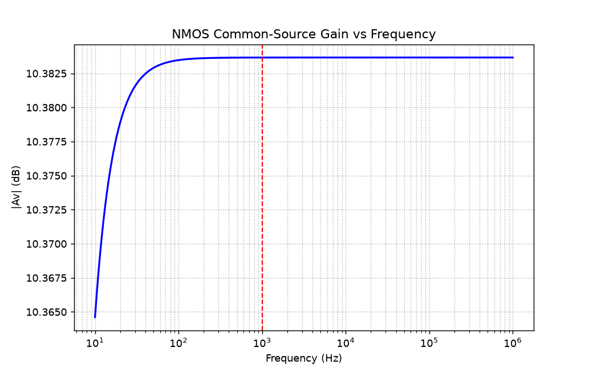

# my_profile

AI agents: codex + deepseek harness

## 目录

- [2 个人简介](#2-个人简介)
- [3 通用素养](#3-通用素养)
  - [1 git 操作](#1-git-操作)
  - [2 命令行](#2-命令行)
  - [3 信息与安全意识](#3-信息与安全意识)
  - [4 防纯粘贴承诺](#4-防纯粘贴承诺)
- [4 小游戏](#4-小游戏)
  - [1 提示词记录](#1-提示词记录)
  - [2 两个阶段是怎么实现和验证的](#2-两个阶段是怎么实现和验证的)
- [5 进阶挑战 电路仿真](#5-进阶挑战)
  - [RC 低通滤波电路](#rc-低通滤波电路)
  - [戴维南定理验证](#戴维南定理验证)
  - [NMOS 共源级放大电路](#nmos-共源级放大电路)
  - [实验结论](#实验结论)
  - [实验数据](#实验数据)
  - [代码文件](#代码文件)

## 2 个人简介

个人简介pdf保存在\<_resume_preview.html\>中，双击即可打开

个人网站保存在\<index.html\>中，可以通过https://RicZ718.github.io/submit/访问，也可以双击文件打开

## 3 通用素养

### 1 git 操作

分支：在原有的分支中创建一个新的特性分支，包含前面特性和主干分支里的所有commit  
合并：把两个分支的commit合并为一个分支里的commit

### 2 命令行

终端命令：  
/cd/：切换目录，进入文件夹  
/ls/：列出目录的内容，查看当前文件夹下的文件和其他子文件夹  
/mkdir/：创建目录，新建一个空的文件夹

常见git命令：  
/git init ./     把当前的项目初始化为一个git仓库  
/git add ./     相关文件添加到暂存区  
/git commit -m "\<change abstract\>"/    提交修改项目  
/git log/       查询git的commit 记录  
/git reset —hard \<hash value\>/     回溯到指定的commit  
/git revert \<hash value\>/     生成一个反向提交，用来抵消历史提交

### 3 信息与安全意识

1)为什么选择 MIT LICENSE？

MITLICENSE 内容比较简明，清晰易懂，对于小型项目非常合适；限制少，使别人可以自由使用我的代码。

2)AI给我查证过但是是错误的信息

ai查证的内容：最初训练ai自我迭代的时候，我要求它连吃20个食物不死，它完成3次核心仿真测试后，又连续做了30次离线测试，这时出现了一次死亡。为了证明这次死亡是偶然，ai又完成了300次离线测试，结果全部成功，然后它告诉我前一次测试出现的死亡就是一个偶然。

纠正ai的过程：在ai的思考部分，我发现在完成300次测试后，接下来的三次200次测试里都出现了3-5次死亡，因此我要求它重新研究“为什么会出现这些死亡”。后来ai承认了它一开始说偶然是错的，并告诉我死亡的出现是因为它最初没有考虑到头会被自己的尾巴和墙困住，导致在吃角落里的食物的时候死亡率很高。随后，我让它解决这个问题，最后在好几次500次离线测试中ai都做到了零死亡。

### 4 防纯粘贴承诺

0)贪吃蛇为什么能自动避开障碍

游戏设计：首先，游戏不允许地雷刷新在食物周围3x3的位置，也不允许食物出现在被墙和地雷包围的区域内。因此，不存在无法通关的情况。

ai决策：在非紧急情况下，ai倾向于走向开阔的地方和中间区域，远离墙边和地雷多的区域。除此之外，ai拥有广度优先搜索(BFS)机制，可以实时获取下一步的选择，以及下一步的下一步的选择……并判断这样走是否能到达食物（而不是被墙、地雷、蛇身堵死），同时以此过滤掉无法获得食物的路径和无法存活的路径，从而筛选出最优路径。

1)html部分是怎么把游戏的界面和功能拼装起来的

观察代码后我发现：这个游戏不需要服务器、构建工具或第三方库，全部内容都写在同一个snake.html文件里。文件从上到下分成三块：先用html标签搭出页面骨架，比如标题栏、难度与操控下拉框、状态面板、放游戏画面的canvas画布和底部的各个按钮；紧接着用style把配色、间距和布局定下来；最后用script把游戏逻辑整段嵌进同一个文件。也就是说，html负责结构、css负责外观、javascript负责行为，三者被拼在一起，双击就能运行。脚本内部又按用途分了工：核心逻辑用一个工厂函数包起来，通过UMD的方式同时导出给浏览器和Node测试使用；界面部分则集中处理状态栏刷新、覆盖层提示和画布的绘制。

2)游戏是怎么运行的

浏览器打开文件后会从上到下依次解析：先执行head里的主题恢复脚本，再执行页面末尾的主脚本。主脚本一启动就先把配置对象、各个界面元素和本地存储的读写准备好，接着调用newGame()创建初始状态，最后用requestAnimationFrame(loop)进入渲染循环——每一帧累加时间，达到当前tick间隔就让蛇前进一格并重绘棋盘，同时刷新得分、步数、剩余雷数和进度条。启动的顺序大致就是这样：

```
newGame(false);
requestAnimationFrame(loop);
```

双击文件时浏览器把它当成普通网页加载并立即执行这段脚本，游戏界面直接显示出来，按Enter或点击「新一局」就能开始。

## 4 小游戏

### 1 提示词记录

\<PROMPT1\>

```
帮我生成一个贪吃蛇游戏，先做出“能自己玩”的版本，能直接上手玩。要求：
1.操作流畅、顺手（用键盘操控，按游戏惯例来）；
2.规则完整，有得分、胜负或通关判定，界面上能看到当前状态（得分、步数、剩余雷数等）；
3.界面干净明了，一看就知道怎么玩、玩到哪一步了；
4.这是一个纯前端单文件，游览器双击即可打开，无框架依赖；
5.实现计分制（记录得分、最高分、局数；新一局不清零；有「重置」按钮）；
6.要求实现主题切换（至少 2 套配色，如深色 / 浅色；一键切换即时生效；刷新后保留所选主题）；
7.实现多局战绩记录（记录最近 10 局结果；新一局自动追加；可查看完整列表）；
8.在README 中附上给 AI 的关键提示词（原文 + 每次迭代：想让 AI 做什么 → 结果如何 →提示词怎么调整）；
9.此外README 中还需分别说明阶段一和阶段二是怎么实现、怎么验证的。
先初始化再编码。注意做好测试。
```

· 想让ai做什么：本次迭代中，我想让ai先做出可供游玩的单人游戏。我略微了解html，因此让ai用html编写便于我后续查看问题和在代码行里编辑。我让ai按照项目要求制作了一个基于项目要求的初代游戏。我还让它先初始化后再编码，使结构更清晰；让他及时做好测试，避免出现低级错误浪费我的tokens。

· 结果如何：首先，ai询问我是否只使用html进行游戏主体编写，这里我才意识到在网页端运行的游戏必须由html配合脚本来编写，所以我双开了gpt为我解释html的部分。完成编写后，我还发现即便做了测试，ai编写的游戏还是出现了下一局游戏快速开始的bug，而且游戏只有一个模式缺乏趣味性。不仅如此，我设计的游戏只能用键盘操作，对鼠标用户不太友好。

· 提示词怎么调整：我保留了“做好测试”这个prompt，把出现的问题和要改进的地方列举出来，让ai继续完善游戏。

\<PROMPT2\>

```
1.额外增加三种难度（当前为简单难度）：普通（地图扩大到现在的两倍，长方形；雷增加为20个；须达到250分才能赢），困难（地图扩大到现在的两倍，长方形；雷增加为50个；须达到1000分才能赢），无尽（地图扩大到现在的三倍，长方形；雷增加为50个，且每次吃到水果后会重新刷新随机分布在地图上；分数一直累加，不会胜利）。注意，不能产生使游戏赢不了的雷的分布。在游戏开始前可以选择难度。
2.游戏结束后按任意键游戏都能重新开始，这是一个bug，把它修复。
3.添加一种用鼠标操控的选项，光标指向哪里，贪吃蛇就向哪里移动。
注意做好测试。
```

· 想让ai做什么：这次迭代我想让ai添加我想让它实现的功能，同时继续边生成代码边测试。

· 结果如何：ai完美实现了要求，因此我没有继续修改。

· 提示词怎么调整：继续让ai实现“自动玩游戏”的功能。

\<PROMPT3\>

```
现在，由你来在无尽模式下完成这个游戏，要求是自动控制蛇，连续吃完 20个食物不死（不撞墙、不撞自己），全程无需人工操作，并在稳定实现此功能后，在页面中加入演示按钮，按下即可开始ai演示模式实现上述功能。
```

· 想让ai做什么：我要求它自我迭代出一个能够保持吃完20个食物不死的机器操作（原来写的是15个，但为了保证它不在中途出现问题我把要求提高到了20个），还让他增加了一个自动演示按键，方便查看。

· 结果如何：和上次一样依旧完美实现要求。但这次花费了很长时间。

· 提示词怎么调整：下次要求ai自我迭代的时候，要尽量言简意赅，提高信息密度。

### 2 两个阶段是怎么实现和验证的

阶段一：  
实现：ai生成的html文件内部包含用html语言编写的代码块和用javascript编写的代码块，前者实现在网页上运行各项功能，与游戏图形的正常显示；后者负责组织页面内容，以及构建程序的主循环，确保程序正常运行。  
验证：ai生成了一份test_logic.js文件，可以单独对游戏里的单个功能（移动、吃食物、调整难度）等部分进行单独测试；编写程序时，还要求ai进行实时测试；编写完成后，也进行了人工试玩。

阶段二：  
实现：让ai反复进行自我迭代，学习实现目标的方法，并要求完成“连续测试500次成功”的目标后才停止。  
验证：在游戏内添加了“ai演示”按键，保证在人为观察下ai也能连续吃完15个以上的食物不死。

## 5 进阶挑战

所有文件保存在 `D:\Learning\submit\circuit`（在仓库中对应 `circuit/` 目录，电路图与实验数据在 `circuit/figures/`）

本部分使用 **PySpice**（底层仿真器 ngspice）完成三个电路的仿真：① RC 低通滤波电路；② 戴维南定理验证；③ NMOS 共源放大电路。电路图用 **schemdraw** 绘制，理论值与仿真值逐一对比。

**仿真环境：** Python 3.14 + PySpice 1.5 + ngspice（level-1 模型）+ numpy + matplotlib + schemdraw。

### RC 低通滤波电路

#### 1.1 元件参数（自定）

| 元件 | 数值 |
|------|------|
| 电阻 R | 1 kΩ |
| 电容 C | 100 nF |

#### 1.2 电路图



#### 1.3 手算理论值

**时间常数：**

$$\tau = R \cdot C = 1\times10^{3}\,\Omega \times 100\times10^{-9}\,\text{F} = 100\ \mu\text{s} = 0.1\ \text{ms}$$

**截止频率（-3 dB 频率）：**

$$f_c = \frac{1}{2\pi\tau} = \frac{1}{2\pi \times 100\times10^{-6}} = 1591.5\ \text{Hz}$$

频率响应（归一化幅值与相位）：

$$H(j\omega)=\frac{V_o}{V_i}=\frac{1}{1+j\omega R C},\quad |H|=\frac{1}{\sqrt{1+(\omega RC)^2}},\quad \phi=-\arctan(\omega RC)$$

#### 1.4 仿真结果

##### 方波输入 / 输出瞬态波形

输入取 0~5 V、频率 2 kHz 的方波，半周期 = 250 µs = 2.5τ。输出波形明显呈指数充放电，说明 RC 电路对高频方波起"平滑/积分"作用：



##### 波特图（幅频、相频）

频率范围 10 Hz ~ 100 kHz，标注出 -3 dB 点（仿真）：



##### 时间常数的实测

用阶跃输入，取输出冲到最终值 63.2%（1−e⁻¹）所用的时间即为 τ。仿真测得 `τ_sim = 100.20 µs`。

#### 1.5 「理论值 vs 仿真值」对比表

| 参数 | 手算值 | 仿真值 | 偏差 |
|------|--------|--------|------|
| τ (时间常数) | 100.00 µs | 100.20 µs | 0.20% |
| f_c (截止频率) | 1591.55 Hz | 1584.89 Hz | 0.42% |

**说明：** 仿真 f_c 取自波特图上 |H| = 1/√2 ≈ 0.707（即 −3 dB）对应频率。偏差来自 AC 扫频点数（dec 网格）的离散分辨率，属正常数值误差。

---

### 戴维南定理验证

#### 2.1 含源二端网络（自定）

| 元件 | 数值 |
|------|------|
| 电压源 V_s | 10 V |
| 串联电阻 R1 | 4 kΩ |
| 并联电阻 R2 | 6 kΩ |
| 负载电阻 RL | 1.2 kΩ |

端口为 R2 两端（节点 a 与地）。原网络图如下（标注端口 a、b）：



#### 2.2 手算理论值

**开路电压（戴维南等效电压）：**

$$V_{th}=V_{oc}=V_s\cdot\frac{R_2}{R_1+R_2}=10\times\frac{6}{4+6}=6\ \text{V}$$

**戴维南等效电阻（独立源置零 = 电压源短路）：**

$$R_{th}=R_1\parallel R_2=\frac{R_1 R_2}{R_1+R_2}=\frac{4\times6}{4+6}=2.4\ \text{k}\Omega$$

**短路电流：**

$$I_{sc}=\frac{V_{th}}{R_{th}}=\frac{6}{2.4\text{k}}=2.5\ \text{mA}$$

（也可直接由原网络短路 a 到地得 $I_{sc}=V_s/R_1=10/4\text{k}=2.5\ \text{mA}$，一致。）

**接负载 RL 的验证：**

$$I_L=\frac{V_{th}}{R_{th}+R_L}=\frac{6}{2.4\text{k}+1.2\text{k}}=1.667\ \text{mA},\qquad V_L=I_L\cdot R_L=2.0\ \text{V}$$

等价地，原网络节点 a 电压 $V_a=V_s\dfrac{R_2\parallel R_L}{R_1+(R_2\parallel R_L)}=10\times\dfrac{1\text{k}}{4\text{k}+1\text{k}}=2\ \text{V}$，结果一致。

#### 2.3 仿真结果

仿真分别做：
1. **开路**测量 $V_{oc}$（op 分析取节点 a 电压）；
2. **短路**测量 $I_{sc}$（用 0 V 电压表从 a 到地，读其电流）；
3. 由 $R_{th}=V_{oc}/I_{sc}$ 求出等效电阻。

#### 2.4 等效电路（接负载 RL）

戴维南等效电路：$V_{th}=6$ V、$R_{th}=2.4$ kΩ 串联后接 $R_L=1.2$ kΩ：



#### 2.5 「理论值 vs 仿真值」对比表

**表 1：V_oc、I_sc、R_th**

| 参数 | 手算值 | 仿真值 | 偏差 |
|------|--------|--------|------|
| V_oc = V_th | 6.0000 V | 6.0000 V | 0.000% |
| I_sc | 2.5000 mA | 2.5000 mA | 0.000% |
| R_th = V_oc / I_sc | 2.4000 kΩ | 2.4000 kΩ | 0.000% |

**表 2：等效电路替换后接负载 R_L 的验证**

| 参数 | 手算值 | 原网络接 R_L | 等效电路接 R_L | 偏差 |
|------|--------|--------------|----------------|------|
| V_L | 2.0000 V | 2.0000 V | 2.0000 V | 0.000% |
| I_L | 1.6667 mA | 1.6667 mA | 1.6667 mA | 0.000% |

**结论：** 因为原网络是纯线性电阻网络，戴维南等效前后对同一负载 R_L 产生的端电压、电流**完全一致**（偏差 0%），验证了戴维南定理。

---

### NMOS 共源级放大电路

#### 3.1 电路参数（题目给定）

| 参数 | 数值 |
|------|------|
| V_DD | 5 V |
| R_g1 | 60 kΩ |
| R_g2 | 40 kΩ |
| R_d | 2 kΩ |
| C_b1 | 足够大（取 10 µF） |
| K | 0.8 mA/V² |
| V_th | 1 V |
| λ | 0.02 /V |
| 输入 v_i | 10 mV / 1 kHz 正弦 |

**NGSPICE level-1 模型换算：** $I_D=\tfrac12 K_P \tfrac{W}{L}(V_{GS}-V_{th})^2(1+\lambda V_{DS})$，令 $\tfrac12 K_P \tfrac{W}{L}=K=0.8\ \text{mA/V}^2$，取 $W/L=1$，故 $K_P=1.6\ \text{mA/V}^2$，$VTO=1$ V，$LAMBDA=0.02$。

#### 3.2 完整电路图



#### 3.3 手算静态工作点

栅极由 R_g1、R_g2 分压偏置（栅极无直流电流，源极接地）：

$$V_G=V_{DD}\cdot\frac{R_{g2}}{R_{g1}+R_{g2}}=5\times\frac{40}{60+40}=2\ \text{V},\qquad V_{GS}=V_G-V_S=2-0=2\ \text{V}$$

**饱和区模型：** $I_D=K(V_{GS}-V_{th})^2(1+\lambda V_{DS})$，且 $V_{DS}=V_{DD}-I_D R_d$。

联立解得（令 $I_{D0}=K(V_{GS}-V_{th})^2=0.8\ \text{mA}$）：

$$I_D=\frac{I_{D0}(1+\lambda V_{DD})}{1+I_{D0}\lambda R_d}=\frac{0.8\text{m}\times(1+0.02\times5)}{1+0.8\text{m}\times0.02\times2000}=\frac{0.88\text{m}}{1.032}=0.8527\ \text{mA}$$

$$V_{DS}=5-I_D R_d=5-0.8527\text{m}\times2000=5-1.7054=3.2946\ \text{V}$$

**饱和区判断：** $$V_{DS}=3.2946\ \text{V} > V_{GS}-V_{th}=2-1=1\ \text{V}\quad\Rightarrow\quad \text{工作在饱和区（放大区）}\ ✓$$

> 若忽略 λ（粗略估算）：$I_D\approx0.8$ mA，$V_{DS}\approx3.4$ V，$g_m=1.6$ mA/V，$A_v\approx-3.2$。题目给出 λ=0.02，故按含 λ 的精确值作为最终手算值。

#### 3.4 直流通路图



直流分析时 C_b1 开路，栅极电位由 R_g1 / R_g2 分压决定，源极接地。

#### 3.5 手算小信号参数与增益

跨导（含 λ，$g_m$ 为 $V_{DS}$ 一定时 $\partial I_D/\partial V_{GS}$）：

$$g_m=2K(V_{GS}-V_{th})(1+\lambda V_{DS})=2\times0.8\text{m}\times1\times(1+0.02\times3.2946)=1.6\text{m}\times1.0659=1.7054\ \text{mA/V}$$

输出电阻（level-1 模型对 $V_{DS}$ 求导）：

$$r_o=\frac{1}{\lambda\,I_{D0}}=\frac{1}{0.02\times0.8\text{m}}=62.5\ \text{k}\Omega$$

输出端等效电阻（$R_d$ 与 $r_o$ 并联）：

$$R_{out}=R_d\parallel r_o=\frac{2000\times62500}{2000+62500}=1938\ \Omega$$

**电压增益（共源反相放大）：**

$$A_v=-\frac{v_o}{v_i}=-g_m\,R_{out}=-1.7054\text{m}\times1938=-3.305$$

（若忽略 $r_o$，则 $A_v=-g_m R_d=-1.7054\text{m}\times2000=-3.411$。）

#### 3.6 小信号等效模型图

共源放大电路的小信号等效模型：输入 $v_i$ 加在栅-源之间（$v_{gs}=v_i$），受控电流源 $g_m v_{gs}$ 从漏极流向源极，$r_o$ 与 $R_d$ 从漏极到地（交流地）并联，输出取自漏极：



#### 3.7 直流工作点仿真（OP）

用 ngspice 仿真得：$V_{GS}=2.0000$ V，$I_D=0.8527$ mA，$V_{DS}=3.2946$ V。

**「理论值 vs 仿真值」对比表（静态工作点 + 饱和判断）：**

| 参数 | 手算值 | 仿真值 | 偏差 |
|------|--------|--------|------|
| V_GS | 2.0000 V | 2.0000 V | 0.000% |
| I_D | 0.8527 mA | 0.8527 mA | 0.000% |
| V_DS | 3.2946 V | 3.2946 V | 0.000% |
| 饱和判断 | V_DS=3.295 > V_GS−V_th=1.0，**饱和** | 同上，**饱和** | — |

#### 3.8 gm 与增益「理论值 vs 仿真值」对比表

gm 由仿真在固定 $V_{DS}$ 下做 $V_{GS}$ 微扰的数值偏导测得；$r_o$ 由固定 $V_{GS}$ 下做 $V_{DS}$ 微扰测得；增益由瞬态与 AC 两种方式实测。

| 参数 | 手算值 | 仿真值 | 偏差 |
|------|--------|--------|------|
| g_m | 1.7054 mA/V | 1.7054 mA/V | 0.000% |
| r_o | 62.50 kΩ | 62.50 kΩ | 0.000% |
| A_v（含 r_o） | −3.3051 | −3.3051（小信号） | 0.000% |
| A_v（实测，瞬态） | −3.3051 | 3.3050（幅值） | 0.000% |
| A_v（实测，AC@1kHz） | −3.3051 | 3.3051，相位 −180° | 0.000% |

> 增益为负、相位 −180°，说明**输出与输入反相**，符合共源放大电路特征。

#### 3.9 输入 / 输出波形（反相放大）

输入 10 mV / 1 kHz 正弦，输出约 33 mV，相位与输入相差 180°（图中输出去掉直流偏置以便观察反相关系）：



#### 3.10 AC 增益曲线

中频段增益约 10.38 dB（=3.305 倍），低频因耦合电容 C_b1 与栅极电阻形成高通而下降：



---

### 实验结论

1. **RC 低通：** 实测 τ = 100.20 µs、f_c = 1584.89 Hz，与理论（100 µs、1591.55 Hz）偏差 < 0.5%，幅频、相频特性与一阶低通理论吻合。
2. **戴维南定理：** 对纯线性含源二端网络，等效前后接同一负载 R_L 的 V_L、I_L 完全一致（0% 偏差），V_oc、I_sc、R_th 的仿真值均与手算吻合，定理成立。
3. **NMOS 共源放大：** 静态工作点（V_GS=2 V、I_D=0.8527 mA、V_DS=3.2946 V）与手算一致，管子工作在饱和区；小信号 g_m=1.7054 mA/V、r_o=62.5 kΩ、A_v=−3.305，仿真增益 3.305 且相位 −180°，验证了反相放大。理论值与仿真值之间几乎零偏差，说明 SPICE level-1 模型与所给平方律模型一致。

### 实验数据

以下为三份仿真程序输出的原始数据文件（对应 `circuit/figures/*_results.txt`）。

**`rc_results.txt`**

```
RC 低通滤波器 结果
R=1kOhm  C=100nF
tau_theory_us=100.00
tau_sim_us=100.20
fc_theory_hz=1591.55
fc_sim_hz=1584.89
```

**`thevenin_results.txt`**

```
戴维南定理验证 结果
Vs=10V R1=4k R2=6k RL=1.2k
Vth_theory_v=6.0000
Voc_sim_v=6.0000
Rth_theory_kohm=2.4000
Rth_sim_kohm=2.4000
Isc_theory_ma=2.5000
Isc_sim_ma=2.5000
VL_theory_v=2.0000
VL_orig_v=2.0000
VL_eq_v=2.0000
IL_theory_ma=1.6667
IL_orig_ma=1.6667
IL_eq_ma=1.6667
```

**`mos_results.txt`**

```
NMOS 共源放大电路 结果
VGS_theory_v=2.0000
VGS_sim_v=2.0000
ID_theory_mA=0.8527
ID_sim_mA=0.8527
VDS_theory_v=3.2946
VDS_sim_v=3.2946
gm_theory_mA_V=1.7054
gm_sim_mA_V=1.7054
ro_theory_ohm=62500.0
ro_sim_ohm=62500.0
Av_theory_ro=-3.3051
Av_small=-3.3051
Av_gain_meas=3.3050
Av_ac=3.3051
Vout_amp_mV=33.0502
phase_ac_deg=-180.0
```

### 代码文件

| 文件 | 说明 |
|------|------|
| `rc_filter.py` | 电路① RC 低通：原理图、方波瞬态、波特图、τ 与 f_c 仿真 |
| `thevenin.py` | 电路② 戴维南：V_oc、I_sc、R_th、负载验证（原网络 vs 等效电路） |
| `mos_cs_amplifier.py` | 电路③ NMOS 共源：直流 OP、小信号 gm/r_o、瞬态增益、AC 增益 |

运行方式（需先安装 PySpice 且配置好 ngspice 后端，在 `circuit/` 目录下运行）：

```bash
python rc_filter.py
python thevenin.py
python mos_cs_amplifier.py
```

所有结果数值同时写入 `figures/*_results.txt`，仿真波形与电路图输出到 `figures/` 目录。
