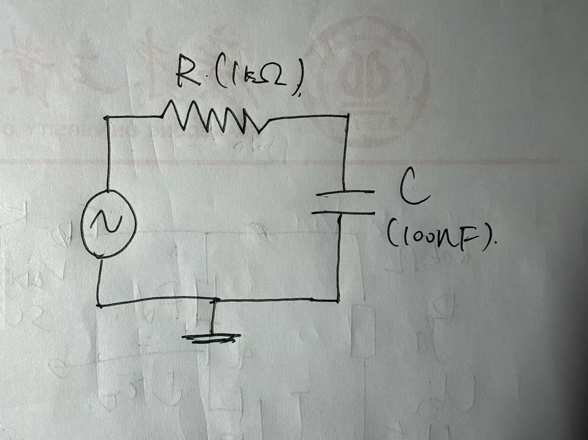
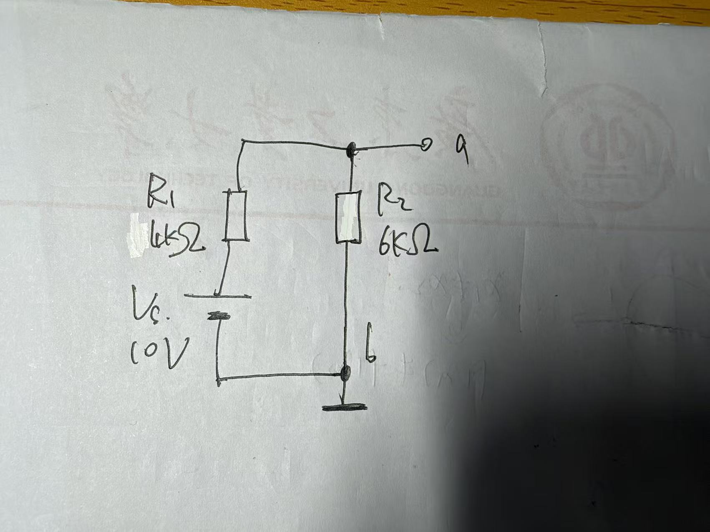
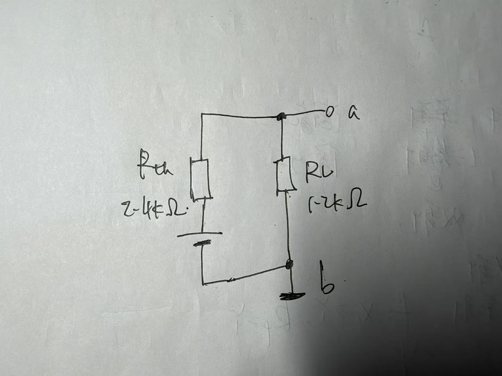
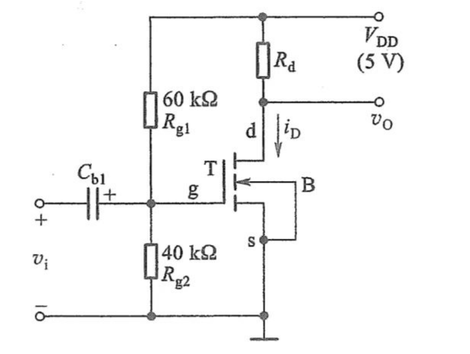
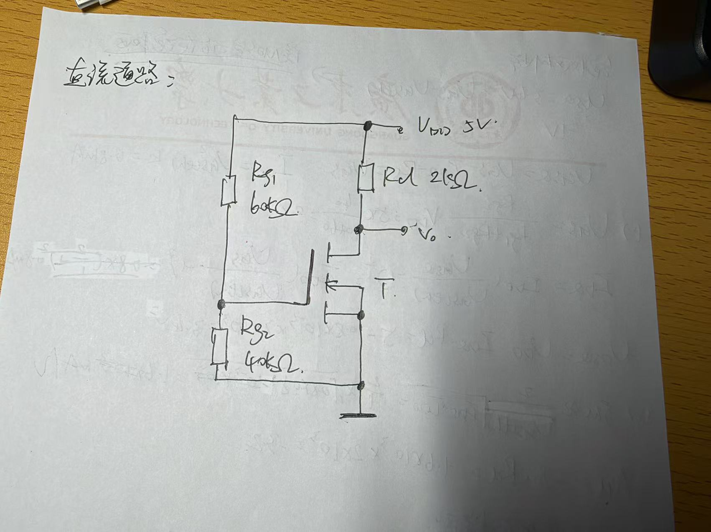
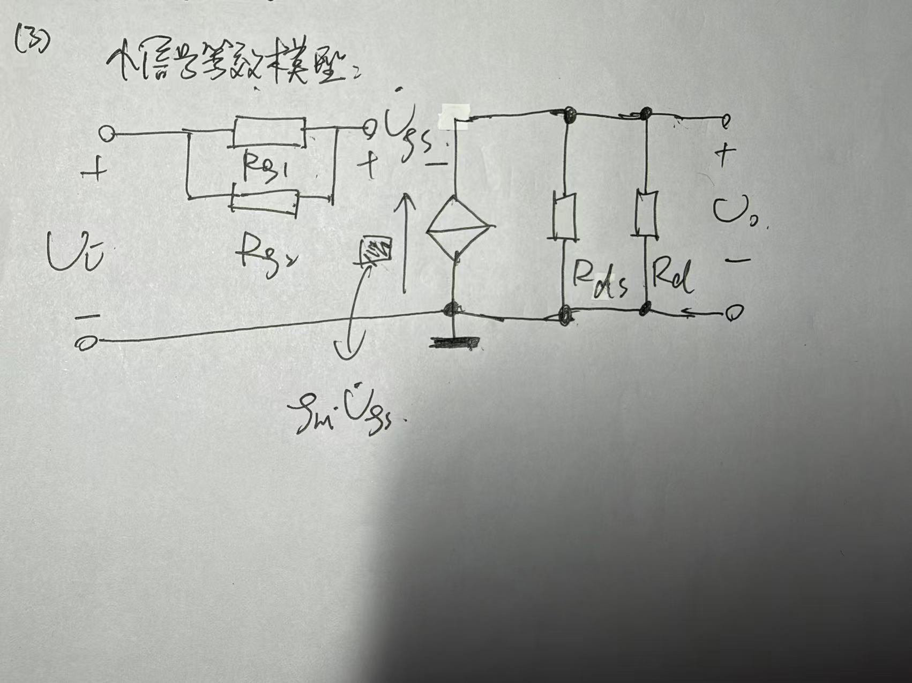

# 电路仿真实验报告（PySpice）

本报告使用 **PySpice**（底层仿真器 ngspice）完成三个电路的仿真：① RC 低通滤波电路；② 戴维南定理验证；③ NMOS 共源放大电路。电路图用 **schemdraw** 绘制，理论值与仿真值逐一对比。

**仿真环境：** Python 3.14 + PySpice 1.5 + ngspice（level-1 模型）+ numpy + matplotlib + schemdraw。

---

## 一、RC 低通滤波电路

### 1.1 元件参数（自定）

| 元件 | 数值 |
|------|------|
| 电阻 R | 1 kΩ |
| 电容 C | 100 nF |

### 1.2 电路图



### 1.3 手算理论值

**时间常数：**

$$\tau = R \cdot C = 1\times10^{3}\,\Omega \times 100\times10^{-9}\,\text{F} = 100\ \mu\text{s} = 0.1\ \text{ms}$$

**截止频率（-3 dB 频率）：**

$$f_c = \frac{1}{2\pi\tau} = \frac{1}{2\pi \times 100\times10^{-6}} = 1591.5\ \text{Hz}$$

频率响应（归一化幅值与相位）：

$$H(j\omega)=\frac{V_o}{V_i}=\frac{1}{1+j\omega R C},\quad |H|=\frac{1}{\sqrt{1+(\omega RC)^2}},\quad \phi=-\arctan(\omega RC)$$

### 1.4 仿真结果

#### 方波输入 / 输出瞬态波形

输入取 0~5 V、频率 2 kHz 的方波，半周期 = 250 µs = 2.5τ。输出波形明显呈指数充放电，说明 RC 电路对高频方波起"平滑/积分"作用：


#### 波特图（幅频、相频）

频率范围 10 Hz ~ 100 kHz，标注出 -3 dB 点（仿真）：


#### 时间常数的实测

用阶跃输入，取输出冲到最终值 63.2%（1−e⁻¹）所用的时间即为 τ。仿真测得 `τ_sim = 100.20 µs`。

### 1.5 「理论值 vs 仿真值」对比表

| 参数 | 手算值 | 仿真值 | 偏差 |
|------|--------|--------|------|
| τ (时间常数) | 100.00 µs | 100.20 µs | 0.20% |
| f_c (截止频率) | 1591.55 Hz | 1584.89 Hz | 0.42% |

**说明：** 仿真 f_c 取自波特图上 |H| = 1/√2 ≈ 0.707（即 −3 dB）对应频率。偏差来自 AC 扫频点数（dec 网格）的离散分辨率，属正常数值误差。

---

## 二、戴维南定理验证

### 2.1 含源二端网络（自定）

| 元件 | 数值 |
|------|------|
| 电压源 V_s | 10 V |
| 串联电阻 R1 | 4 kΩ |
| 并联电阻 R2 | 6 kΩ |
| 负载电阻 RL | 1.2 kΩ |

端口为 R2 两端（节点 a 与地）。原网络图如下（标注端口 a、b）：



### 2.2 手算理论值

**开路电压（戴维南等效电压）：**

$$V_{th}=V_{oc}=V_s\cdot\frac{R_2}{R_1+R_2}=10\times\frac{6}{4+6}=6\ \text{V}$$

**戴维南等效电阻（独立源置零 = 电压源短路）：**

$$R_{th}=R_1\parallel R_2=\frac{R_1 R_2}{R_1+R_2}=\frac{4\times6}{4+6}=2.4\ \text{k}\Omega$$

**短路电流：**

$$I_{sc}=\frac{V_{th}}{R_{th}}=\frac{6}{2.4\text{k}}=2.5\ \text{mA}$$

（也可直接由原网络短路 a 到地得 $I_{sc}=V_s/R_1=10/4\text{k}=2.5\ \text{mA}$，一致。）

**接负载 RL 的验证：**

$$I_L=\frac{V_{th}}{R_{th}+R_L}=\frac{6}{2.4\text{k}+1.2\text{k}}=1.667\ \text{mA},\qquad V_L=I_L\cdot R_L=2.0\ \text{V}$$

等价地，原网络节点 a 电压 $V_a=V_s\dfrac{R_2\parallel R_L}{R_1+(R_2\parallel R_L)}=10\times\dfrac{1\text{k}}{4\text{k}+1\text{k}}=2\ \text{V}$，结果一致。

### 2.3 仿真结果

仿真分别做：
1. **开路**测量 $V_{oc}$（op 分析取节点 a 电压）；
2. **短路**测量 $I_{sc}$（用 0 V 电压表从 a 到地，读其电流）；
3. 由 $R_{th}=V_{oc}/I_{sc}$ 求出等效电阻。

### 2.4 等效电路（接负载 RL）

戴维南等效电路：$V_{th}=6$ V、$R_{th}=2.4$ kΩ 串联后接 $R_L=1.2$ kΩ：



### 2.5 「理论值 vs 仿真值」对比表

**表 1：V_oc、I_sc、R_th**

| 参数 | 手算值 | 仿真值 | 偏差 |
|------|--------|--------|------|
| V_oc = V_th | 6.0000 V | 6.0000 V | 0.000% |
| I_sc | 2.5000 mA | 2.5000 mA | 0.000% |
| R_th = V_oc / I_sc | 2.4000 kΩ | 2.4000 kΩ | 0.000% |

**表 2：等效电路替换后接负载 R_L 的验证**

| 参数 | 手算值 | 原网络接 R_L | 等效电路接 R_L | 偏差 |
|------|--------|--------------|----------------|------|
| V_L | 2.0000 V | 2.0000 V | 2.0000 V | 0.000% |
| I_L | 1.6667 mA | 1.6667 mA | 1.6667 mA | 0.000% |

**结论：** 因为原网络是纯线性电阻网络，戴维南等效前后对同一负载 R_L 产生的端电压、电流**完全一致**（偏差 0%），验证了戴维南定理。

---

## 三、NMOS 共源级放大电路

### 3.1 电路参数（题目给定）

| 参数 | 数值 |
|------|------|
| V_DD | 5 V |
| R_g1 | 60 kΩ |
| R_g2 | 40 kΩ |
| R_d | 2 kΩ |
| C_b1 | 足够大（取 10 µF） |
| K | 0.8 mA/V² |
| V_th | 1 V |
| λ | 0.02 /V |
| 输入 v_i | 10 mV / 1 kHz 正弦 |

**NGSPICE level-1 模型换算：** $I_D=\tfrac12 K_P \tfrac{W}{L}(V_{GS}-V_{th})^2(1+\lambda V_{DS})$，令 $\tfrac12 K_P \tfrac{W}{L}=K=0.8\ \text{mA/V}^2$，取 $W/L=1$，故 $K_P=1.6\ \text{mA/V}^2$，$VTO=1$ V，$LAMBDA=0.02$。

### 3.2 完整电路图



### 3.3 理论静态工作点（手算）

栅极由 R_g1、R_g2 分压偏置（栅极无直流电流，源极接地）：

$$V_G=V_{DD}\cdot\frac{R_{g2}}{R_{g1}+R_{g2}}=5\times\frac{40}{60+40}=2\ \text{V},\qquad V_{GS}=V_G-V_S=2-0=2\ \text{V}$$

按平方律（忽略沟道长度调制 λ）：

$$I_D=K(V_{GS}-V_{th})^2=0.8\text{m}\times(2-1)^2=0.80\ \text{mA}$$

$$V_{DS}=V_{DD}-I_D R_d=5-0.80\text{m}\times2000=3.40\ \text{V}$$

**饱和区判断：** $$V_{DS}=3.40\ \text{V} > V_{GS}-V_{th}=2-1=1\ \text{V}\quad\Rightarrow\quad \text{工作在饱和区（放大区）}\ ✓$$

### 3.4 直流通路图



直流分析时 C_b1 开路，栅极电位由 R_g1 / R_g2 分压决定，源极接地。

### 3.5 理论小信号参数与增益（手算）

跨导：

$$g_m=2K(V_{GS}-V_{th})=2\times0.8\text{m}\times(2-1)=1.60\ \text{mA/V}$$

**电压增益（共源反相放大，忽略 $r_o$）：**

$$A_v=-\frac{v_o}{v_i}=-g_m R_d=-1.60\text{m}\times2000=-3.20$$

### 3.6 小信号等效模型图

共源放大电路的小信号等效模型：输入 $v_i$ 加在栅-源之间（$v_{gs}=v_i$），受控电流源 $g_m v_{gs}$ 从漏极流向源极，$r_o$ 与 $R_d$ 从漏极到地（交流地）并联，输出取自漏极：



### 3.7 「理论值 vs 仿真值」对比表

**理论值**取上两节平方律手算结果（忽略 λ 与 r_o）；**仿真值**由 PySpice / ngspice 的 level-1 模型（含 λ=0.02 /V）仿真得到——静态工作点取自直流 OP，$g_m$ 由固定 $V_{DS}$ 微扰 $V_{GS}$ 的数值偏导得到，增益由瞬态与 AC 两种方式实测。

| 参数 | 理论值 | 仿真值 | 偏差 |
|------|--------|--------|------|
| V_GS | 2.0000 V | 2.0000 V | 0.00% |
| I_D | 0.8000 mA | 0.8527 mA | 6.59% |
| V_DS | 3.4000 V | 3.2946 V | 3.10% |
| g_m | 1.6000 mA/V | 1.7054 mA/V | 6.59% |
| A_v | −3.2000 | −3.3051 | 3.28% |
| r_o | —（理论忽略） | 62.50 kΩ | — |
| R_out = R_d∥r_o | —（理论忽略） | 1.938 kΩ | — |
| 饱和判断 | V_DS=3.40 V > V_GS−V_th=1.0 V，**饱和** | V_DS=3.2946 V > V_GS−V_th=1.0 V，**饱和** | 两者一致 |

> **偏差来源：** 理论手算忽略了沟道长度调制 λ，而仿真模型含 λ=0.02 /V，使 I_D 与 g_m 增大约 6.6%、V_DS 与 A_v 变化约 3%。两者均判断管子工作在饱和区；增益为负（相位 −180°），说明**输出与输入反相**，符合共源放大电路特征。

### 3.8 输入 / 输出波形（反相放大）

输入 10 mV / 1 kHz 正弦，输出约 33 mV，相位与输入相差 180°（图中输出去掉直流偏置以便观察反相关系）：


### 3.9 AC 增益曲线

中频段增益约 10.38 dB（=3.305 倍），低频因耦合电容 C_b1 与栅极电阻形成高通而下降：


---

## 四、实验结论

1. **RC 低通：** 实测 τ = 100.20 µs、f_c = 1584.89 Hz，与理论（100 µs、1591.55 Hz）偏差 < 0.5%，幅频、相频特性与一阶低通理论吻合。
2. **戴维南定理：** 对纯线性含源二端网络，等效前后接同一负载 R_L 的 V_L、I_L 完全一致（0% 偏差），V_oc、I_sc、R_th 的仿真值均与手算吻合，定理成立。
3. **NMOS 共源放大：** 理论手算（忽略 λ）得 V_GS=2 V、I_D=0.80 mA、V_DS=3.40 V、g_m=1.60 mA/V、A_v=−3.2；仿真（含 λ=0.02 /V）得 I_D=0.8527 mA、V_DS=3.2946 V、g_m=1.7054 mA/V、A_v=−3.305（相位 −180°）。两者均判断工作在饱和区，偏差约 3%~6.6%，来源于理论忽略的沟道长度调制 λ，结论一致，验证了共源反相放大。

## 五、代码文件

| 文件 | 说明 |
|------|------|
| `rc_filter.py` | 电路① RC 低通：原理图、方波瞬态、波特图、τ 与 f_c 仿真 |
| `thevenin.py` | 电路② 戴维南：V_oc、I_sc、R_th、负载验证（原网络 vs 等效电路） |
| `mos_cs_amplifier.py` | 电路③ NMOS 共源：直流 OP、小信号 gm/r_o、瞬态增益、AC 增益 |

运行方式（需先安装 PySpice 且配置好 ngspice 后端）：

```bash
python rc_filter.py
python thevenin.py
python mos_cs_amplifier.py
```

所有结果数值同时写入 `figures/*_results.txt`，仿真波形与电路图输出到 `figures/` 目录。
